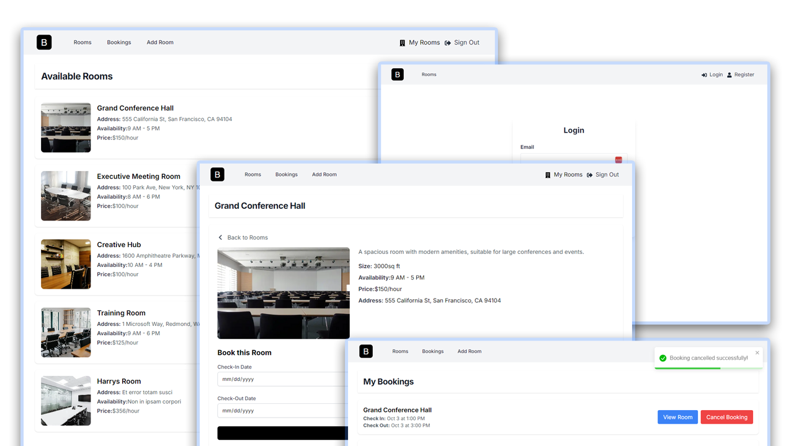

# Bookit App

Meeting room booking application built with Next.js, Appwrite, and Tailwind CSS.

## Table of contents
- [Introduction](#introduction)

- [Features](#features)

- [Tech Stack](#tech-stack)

## Introduction
An interactive meeting room booking application that allows organizations and companies to book conference rooms for meetings, seminars or training. It allows a user to add a room that can be booked. The *my rooms page* shows the room(s) a particular user add.

## Features
**Register as a User**: Users can log on to the register page and fill in their necessary information.

**Log in a User**: Users can go to the log in page, fill in their credentials used in registering and then
log in to have access to other pages in the application.

**Add Room Page**: Allows users to add a room which prospective organizations or companies can book.

**My Room Page**: Shows all the rooms a particular user adds. Clicking a particular room displays the *view* and *delete* buttons. Users can only delete a room that they add. Upon clicking the delete button, a confirmation message pops up asking either to delete or cancel.

**Booking Page**: Shows all the rooms that have been booked. No single room can be booked within the same time frame. Attempting to do that shows an error message.

**Signout Page**: Upon completing a particular task, users can sign out and as well log in again when necessary.

## Tech Stack
- Next.js
- Appwrite
- TailwindCSS